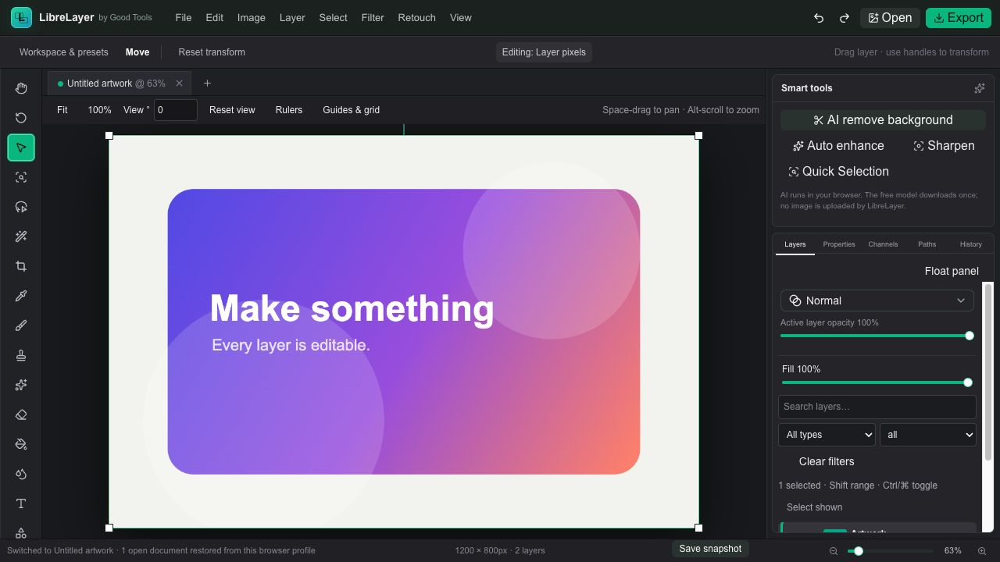

# LibreLayer

LibreLayer is a free, open-source layered image editor that runs in the browser. It provides familiar desktop-style editing workflows without requiring users to upload their work to a server.

[Open LibreLayer](https://librelayer.goodtools.ca) · [Good Tools product page](https://goodtools.ca/tools/librelayer)



## Highlights

- Pixel, text, shape, adjustment, smart-object, and grouped layers
- Editable Smart Filter stacks with live amount, opacity, blend, order, visibility, and filter masks
- Layer masks, vector masks, channels, paths, clipping, linking, and lock controls
- Brushes, selections, crop, transforms, clone, heal, fill, gradients, and filters
- Per-channel curves, levels, color balance, HSL, color grading, and blend modes
- PSD and PSB import, common image formats, editable LibreLayer projects, and web export
- Layered 8/16/32-bit RGB PSD/PSB import with explicit display-working conversion for high-depth sources
- Color-managed TIFF export with embedded sRGB, Display P3, Adobe RGB, or ProPhoto RGB profiles and print-resolution metadata
- Bayer and X-Trans camera RAW development from sensor data with live wide-gamut controls, re-editable RAW Smart Objects, device-local source recovery, and genuine 16-bit TIFF master export
- Tiled floating-point adjustment passes combine exposure, levels, curves, color balance, hue, saturation, vibrance, and channel-mixed black-and-white before one final canvas write
- Responsive active-layer previews update continuously across every combined adjustment and blur control without repeatedly processing the full-resolution document
- Non-destructive adjustment layers retain editable floating-point exposure, levels, curves, hue, saturation, vibrance, color balance, channel-mixed black-and-white, masks, opacity, and blur
- Live RGB and luminance histograms expose shadow and highlight clipping while adjustment-layer controls change
- Direct input-level handles beneath the histogram provide constrained black point, midtone gamma, and white point editing
- Interactive RGB, red, green, and blue tone curves provide draggable shadow and highlight points with keyboard control and live high-precision previews
- Live Portrait, Landscape, Matte, Warm, B&W, and Neutral adjustment presets preview before an explicit Apply and remain fully editable
- Browser-local background removal with a shared cached model runtime, plus assisted tools
- Familiar keyboard shortcuts, history, rulers, guides, tabs, and configurable workspaces
- Named workspace layouts can be applied, renamed, exported, validated on import, and fully reset while preserving browser-local preferences
- Every Layers, Properties, Channels, Paths, and History panel can be tab-stacked, docked, floated, resized, collapsed, or isolated in solo view
- Searchable command palette for every tool and registered menu action with `Cmd/Ctrl+K`
- Branch any history state into an independent editable document and generate pixel-accurate change maps
- Record, export, validate, and replay open `.libreflow` editing workflows without executing arbitrary code
- Password-encrypted layered project packages using local AES-256-GCM encryption
- Device-local autosave, recovery, recent projects, preferences, and optional installation
- Live CMYK/grayscale soft proofing, magenta gamut warnings, document performance/storage reporting, and downloadable PSD compatibility reports
- Importable 3D `.cube` LUTs with live strength, plus waveform, RGB parade, and vectorscope displays
- Captured-reference split and side-by-side review with synchronized zoom, pan, and rotation
- Nondestructive RGB Channel Mixer, Selective Color, Gradient Map, and built-in/imported 3D LUT controls with live previews
- Tonal Shadows/Highlights recovery and targeted Replace Color with adjustable fuzziness
- Independent Hue, Saturation, and Lightness controls for six color ranges
- On-image Hue/Saturation targeting with a visible, editable hue center, width, and soft falloff
- Point and freehand Curves with smoothing and optional black/white endpoint clipping
- Native editable solid-color, gradient, and pattern fill layers with masks, transforms, and persisted recipes
- Editable layer effects with alpha contours, directional shared global light, independent scaling, and copy/paste/clear
- Lossless layer-tree copy/paste between document tabs, preserving groups, masks, links, Smart Objects, native fills, adjustments, and effects
- Deterministic full-family blend math with per-layer gamma-encoded or linear-light calculation
- Versioned pixel-reference compositing fixtures guard opaque, partial-alpha, transparent, gamma, and linear-light results
- Recursive pass-through and isolated groups with shallow/deep knockout and nested clipping stacks
- Linked Smart Objects with browser-persisted file handles, permission-aware refresh, visible missing-link state, relinking, and a packaged embedded fallback
- Shared Smart Object instances whose source replacements propagate without merging instance-specific filters, plus independent-copy conversion and cyclic-dependency rejection on open
- Layered embedded Smart Object source documents that open in linked tabs, synchronize edits to every shared instance, create parent history states, and persist inside the project
- Versioned Smart Filter parameters with separately keyed live-preview and final-render caches, bounded least-recently-used memory, and automatic invalidation after source or parameter changes
- Adaptive Performance, Balanced, and Quality rendering modes scale interactive Smart Filter resolution, final-settle timing, and cache memory to document size and available device resources
- Layer masks with live density, feather, overlay, direct edge refinement, and independent position, rotation, and two-axis scale
- Rectangular, elliptical, single-row, single-column, freehand, polygonal, and optimized magnetic-edge selection tools
- Soft Color Range and Similar matching, Focus Range, shadows/midtones/highlights luminosity masks, Grow, and numeric Transform Selection
- Dedicated Select and Mask workspace with six live preview modes, Smart Radius, Smooth, Feather, Shift Edge, edge-color cleanup, and nondestructive layer-mask output
- Browser-local Subject/People, Sky, Hair, Skin, Clothing, and object selections with adjustable detail sensitivity and color-aware Refine Hair
- Cross-browser deterministic subpixel marquee masks with reference-tested rectangle and supersampled ellipse coverage
- Fractional brush-stroke interpolation plus angle, roundness, pressure/tilt, transfer jitter, dual-tip, wet-edge, airbrush, scatter, texture, and Mixer Brush controls saved in brush presets
- Persistent custom brush-tip library with image/selection capture, ABR pack import, folders, tags, favorites, search, live tip thumbnails, and real custom-tip painting
- Pointer-aware tablet input with pressure/tilt, pen-tip painting, eraser-end support, barrel-button color sampling, protected multi-touch gestures, and larger coarse-pointer controls
- Browser-local Content-Aware Fill workspace with live red/green sampling overlay, four source modes, and adjustable color, rotation, scale, and mirror adaptation
- Detail-weighted Content-Aware Scale with active-selection protection and linear-time processing for large browser documents
- Skew, corner distortion, perspective, mesh, split, cylindrical, Puppet, perspective, Arc, Flag, Fisheye, and Twist warp fields with mask-aware undo
- Persisted undo-history depth and memory budgets with automatic oldest-state compaction under either limit
- Compact visual thumbnails for new history states, plus one-layer restoration that leaves the rest of the document untouched and creates a new undoable state
- Sample-all-layers healing on blank retouch layers, targeted red-eye correction, and one-click frequency separation with editable Low, High, and Retouching layers while preserving the original
- Five reusable Clone Source slots with aligned/unaligned painting, live source overlay, offset, scale, rotation, and horizontal/vertical flipping
- Vertical, horizontal, and radial symmetry painting plus Pattern Stamp, History Brush, and stylized Art History Brush modes backed by real canvas sources
- Browser-local Match Color, HDR toning, perceptual vibrance, and lift/gamma/gain grading wheels
- Editable point and paragraph type with local font loading, variable weight/width controls, OpenType options, bidirectional shaping, language selection, missing-font warnings, and paragraph spacing
- Text placed along real saved-path distance and tangents or fitted inside closed paths, six editable warp styles, shrink/fill box fitting, and per-glyph alpha-contour conversion to editable paths
- Cubic Bézier and Curvature Pen paths with visible draggable anchors and mirrored handles, corner/smooth conversion, numeric direct selection, and Unite/Subtract/Intersect/Exclude operations
- Persisted vector stroke recipes with caps, joins, dash styles, tapered start/end widths, pixel painting, and editable SVG import/export that round-trips LibreLayer width metadata
- Editable artboards with named bounds and backgrounds, nondestructive rectangular/elliptical frame clipping, key-object alignment, equal-gap spacing, and local 1×/2×/3× PNG asset export
- Deterministic Blur Gallery, depth-aware Lens Blur, edge-preserving Surface Blur and noise reduction, Smart Sharpen, and High Pass filters with selection-aware undo/redo
- Bilinear lens correction, displacement, polar-coordinate, wave, ripple, spherize, pixelate, and halftone filters with reproducible output
- Local Oil Paint, Lighting Effects, deterministic Clouds and Fibers, Filter Gallery edge styling, and validated custom 3×3 convolution kernels
- Installable browser-local `.librefilter` plug-ins with an isolated WebAssembly pixel ABI, strict manifests, size limits, and deterministic CPU-kernel fallback
- Background filter workers keep the interface responsive, report progress, support immediate cancellation, stop after a safety timeout, and commit pixels only after successful completion
- Live WebGL2-versus-CPU reference-pixel checks for filter math, with exact maximum-channel-delta reporting and a CPU-only browser fallback
- A checked completion ledger in `LIBRELAYER-10-ROADMAP.md` that distinguishes verified features from remaining professional-parity work

Projects remain on the user's device unless they explicitly export or share a file.

## Run locally

Requirements: Node.js 22.13 or newer and pnpm.

```bash
pnpm install
pnpm dev
```

Open `http://localhost:5173`.

## Validate

```bash
pnpm build
pnpm test:core
pnpm lint
```

## File compatibility

See [PSD-COMPATIBILITY.md](PSD-COMPATIBILITY.md) for the current PSD and PSB compatibility notes. Third-party decoder and renderer notices are included in [public/editor-import-licenses.txt](public/editor-import-licenses.txt).

The [user manual](docs/USER-MANUAL.md), [filter plug-in specification](docs/FILTER-PLUGINS.md), [background-job safety model](docs/BACKGROUND-JOBS.md), [format matrix](docs/FORMAT-MATRIX.md), [privacy and storage model](docs/PRIVACY-AND-STORAGE.md), [migration policy](docs/MIGRATION-POLICY.md), [security policy](SECURITY.md), and [0.1.0 release-candidate notes](docs/RELEASE-NOTES-0.1.0.md) document the current verified scope and limits.

## Contributing

Issues and pull requests are welcome. See [CONTRIBUTING.md](CONTRIBUTING.md) for the complete definition of done, validation gates, and privacy and compatibility expectations.

## License

LibreLayer is released under the [MIT License](LICENSE). Third-party packages and bundled notices retain their own licenses.
